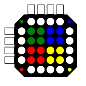

# Pascky Arts games

This is a collection of small games I do in my spare time.

This collection is for Windows OS (I hate Windows, but a lot of people use it), programs built with C# .NET4.8

The executables are compatible with Mono too, so you can run the executable in Linux without any modifications.

All of them are built with Visual Sudio 2019 Community Edition

## Install

As far as I can, I will keep them "installer free". Just copy the file and launch it.

## Uninstall

As said before: just delete the file. No Registry changes. No garbage files in the system.

# List of games

## 4x4 Colour Dot Puzzle

Simple game, yet challengin, made by [Sebastian Coddington](https://www.instructables.com/member/Sebastian+Coddington/) and shared in his Instructables [page of the game](https://www.instructables.com/4x4-Colour-Dot-Puzzle/).

I do not have a 3D printer, but I liked the game.

I wanted to build my own copy and I got the permission to release it as open source (Thanks Sebastian)

### Genesys of the game

Words of Sebastian:
> I completely designed the game from scratch so its my original design
> I looked for inspiration for the game basing myself on a rubiks cube and a fifteen puzzle
> I then later found out after publishing that Rubiks inventor also came up with a similar design  to mine in the 80s called the [rubiks fifteen](https://www.jaapsch.net/puzzles/rubik15.htm) which was pretty surreal to find out that I had unintentionally come up with a similar design to the great inventor of the rubiks cube. 

### Versions

* [1.0 - Download](4x4/Releases/v1.0/4x4.exe): First version of the game. It can surely be optimized and graphically enhanced